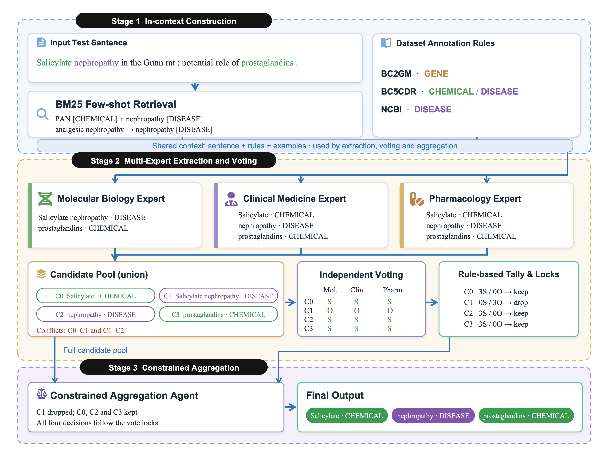

# BioAgent

面向生物医学命名实体识别（Biomedical NER）的多专家 LLM 框架。

## 🏗️ Architecture



## 🚀 Quick Start

### 1. 📦 Environment

在项目根目录执行。当前本地运行环境为 Python 3.13.13、OpenAI Python SDK 1.104.2；专家实验使用文件锁，建议使用 macOS 或 Linux。

```bash
python3 -m venv .venv
source .venv/bin/activate
python3 -m pip install -r requirements.txt
```

### 2. 🔑 API Keys

按所用配置设置环境变量，将占位内容替换为自己的密钥：

```bash
export OPENAI_API_KEY="your-api-key"
export DEEPSEEK_API_KEY="your-deepseek-api-key"
```

当前 GPT、Grok 配置使用 `OPENAI_API_KEY`，DeepSeek 配置使用 `DEEPSEEK_API_KEY`。模型名称和 API 地址由配置中的 `model_name`、`base_url` 指定，运行前需确认自己的 API 服务支持对应模型。

### 3. 📚 Datasets

| 数据集 | 配置名称 | 数据目录 | 实体类型 |
|---|---|---|---|
| BC2GM | `bc2gm` | `bioDataset/bc2gm1/` | `GENE` |
| BC5CDR | `bc5cdr` | `bioDataset/bc5cdr/` | `CHEMICAL`、`DISEASE` |
| NCBI Disease | `ncbi` | `bioDataset/ncbi/` | `DISEASE` |

每个数据目录需包含 `train.json` 和 `test.sampled_500.json`。当前测试配置读取固定的 500 条测试样本；复现实验应使用相同文件及顺序，不重新随机抽样。训练集用于专家框架的示例检索，baseline 不使用检索示例。

输入为 JSON 列表，格式如下：

```json
[
  {
    "sentence": "Aspirin inhibits COX-2.",
    "entities": [
      {"name": "Aspirin", "type": "CHEMICAL", "pos": [0, 7]}
    ]
  }
]
```

上例采用 BC5CDR 的实体类型。`pos` 为从 0 开始的字符区间 `[start, end)`，右端点不包含在实体内。`entities` 是离线评估所用的真实标注。

### 4. ⚙️ Configuration

配置分别位于 `config/baseline/<dataset>/` 和 `config/expert_agent/<dataset>/`。例如，BC5CDR 的 GPT 专家配置为 `config/expert_agent/bc5cdr/bc5cdr_gpt.json`。

| 参数 | 含义 |
|---|---|
| `dataset` | 数据集标识：`bc2gm`、`bc5cdr` 或 `ncbi` |
| `model_name`、`base_url` | 模型名称与 API 地址 |
| `api_key_env` | 保存密钥的环境变量名称 |
| `test_file_path` | 评估数据路径 |
| `max_loop` | 评估样本数，不是重试次数 |
| `retrieval_k` | 专家框架检索的示例数量 |
| `max_attempts` | 专家阶段重试上限；`null` 表示不设次数上限 |
| `summary_csv` | 结果汇总 CSV 路径 |
| `result_root` | 专家实验详细结果根目录 |
| `save_file_path`、`log_file_path` | baseline 的预测和日志路径 |

### 5. ▶️ Run Experiments

以下以 BC5CDR 的 GPT 配置为例，在项目根目录执行。

**Baseline**

```bash
python3 -u baseline/llm.py --config config/baseline/bc5cdr/bc5cdr_gpt.json
```

**Full**

```bash
python3 -u main.py --config config/expert_agent/bc5cdr/bc5cdr_gpt.json --variant full --limit 500
```

**消融实验**

```bash
python3 -u main.py --config config/expert_agent/bc5cdr/bc5cdr_gpt.json --variant without_retrieval --limit 500
```

切换数据集或模型时替换配置路径，切换消融方法时替换 `--variant`：

| 变体 | 实验设置 |
|---|---|
| `full` | 检索、三专家抽取、投票与受约束汇总 |
| `single_expert` | 一位专业专家直接输出，不投票、不汇总 |
| `without_retrieval` | 移除训练示例，保留标注规则和其他阶段 |
| `without_voting` | 三专家抽取后直接汇总，不使用选票和多数票锁定 |
| `candidate_union` | 直接输出三专家候选并集 |
| `vote_only` | 投票后按规则筛选，不调用汇总 Agent |
| `generic_ensemble` | 将三个专业角色替换为相同的通用标注角色 |

`single_expert` 同时移除了投票和汇总，不应解释为仅改变专家数量的单因素实验。

终端实时显示运行进度。普通 baseline 和 full 运行中断后，可在原命令末尾添加 `--resume`，从已完整保存的样本继续；其他消融变体的主入口不支持该参数。

## 📊 Evaluation & Results

Baseline 和专家框架均采用**实体级 micro Precision、Recall 和 F1**。预测实体的 `(start, end, type)` 必须与标注完全一致；跨有效样本累计 TP、FP、FN 后计算：

```text
Precision = TP / (TP + FP)
Recall    = TP / (TP + FN)
F1        = 2TP / (2TP + FP + FN)
```

无效 JSON、非法类型、无法定位的实体及请求失败不进入 PRF 统计。Baseline 持续重试；专家配置默认不设重试次数上限。若为专家设置有限重试上限，失败样本会被排除并单独记录。**有效空预测参与评分**，其中未识别的标注实体计为 FN。

两种方法采用相同的实体匹配与计分口径，但提示词、输入信息和纠错反馈不完全相同。比较结果时，应同时核对输入数据、有效样本数、配置和运行版本。

测试集结果汇总至：

```text
result/test_500/test_500_summary_prf1.csv
```

详细结果分别保存在 `result/test_500/baseline/` 和 `result/test_500/expert_agent/`。专家实验目录包括：

| 文件 | 内容 |
|---|---|
| `predictions.jsonl` | 逐句预测、标注与阶段记录 |
| `metrics.json` | PRF、有效样本数及运行统计 |
| `run_config.json` | 配置、提示词与数据校验信息 |
| `run.log` | 请求、重试与阶段日志 |

## 🧩 Project Structure

以下为运行实验所需的主要目录与文件：

```text
MyBioAgent/
├── main.py                  # 专家实验入口
├── experiment.py            # 实验运行与结果保存
├── tool.py                  # API、检索、响应校验
├── evaluation.py            # 实体级评分
├── reporting.py             # CSV 汇总
├── requirements.txt         # Python 依赖
├── figure/structure.png     # 框架架构图
├── baseline/
│   └── llm.py               # 普通 LLM baseline
├── expert_agent/            # 抽取、投票、汇总及运行辅助模块
│   └── prompts/             # 专家阶段提示词
├── prompts/
│   ├── shared.txt           # 共享任务约定
│   └── annotation_rules/    # 数据集标注规则
├── config/
│   ├── baseline/            # baseline 配置
│   └── expert_agent/        # 专家实验配置
├── bioDataset/              # 训练集与固定测试样本
├── result/                  # 实验结果与汇总
└── README.md
```
